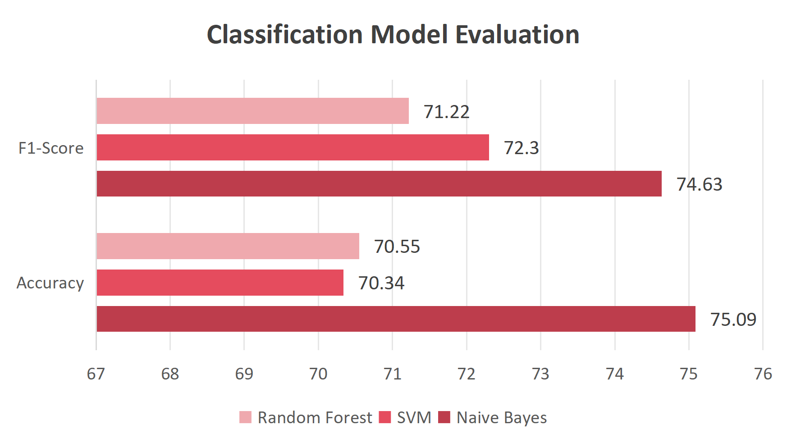
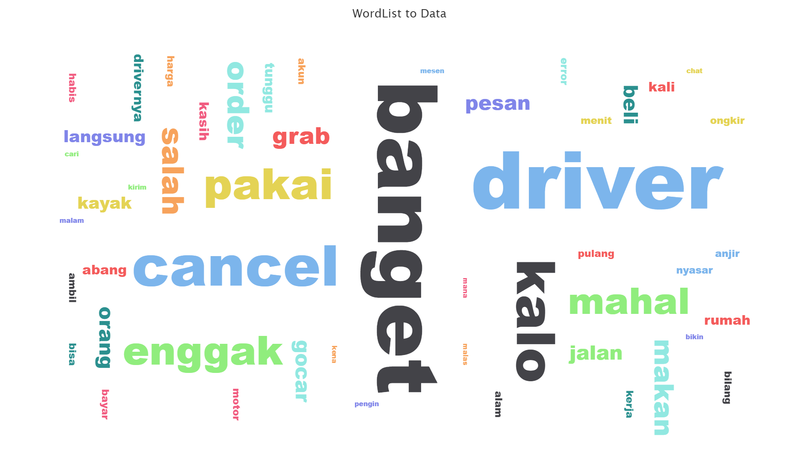

# 🚖 Gojek Service Sentiment Analysis

## 📌 Overview

This project analyzes public sentiment toward Gojek services using Twitter (X) data collected between January–April 2025. The objective was to understand customer perception patterns and compare the performance of multiple machine learning classification models.

## 🛠️ Tools & Technologies

  
  
  
  
  

## ⚙️ Research Workflow

- Tweet crawling and data collection
- Text preprocessing and cleaning
- Sentiment labeling
- Model training and evaluation
- Comparative analysis of:
  - Naïve Bayes
  - Support Vector Machine (SVM)
  - Random Forest

## 📊 Model Performance

| Model | Accuracy | F1-Score |
|---|---|---|
| Naïve Bayes | 75.09% | 74.63% |
| SVM | 70.34% | 72.30% |
| Random Forest | 70.55% | 71.22% |

Naïve Bayes achieved the best overall balance between precision and recall, making it the most stable model for this dataset.

## 💡 Key Insights

The analysis found that negative sentiment was primarily influenced by:
- Technical application issues
- Customer service responsiveness
- Driver cancellation experience

The findings suggest that improving system stability and customer support quality could help increase overall customer satisfaction.

## 🖼️ Project Preview

  
  

## 📚 Research Context

This project was developed as a final thesis project for the Information Systems undergraduate program.
